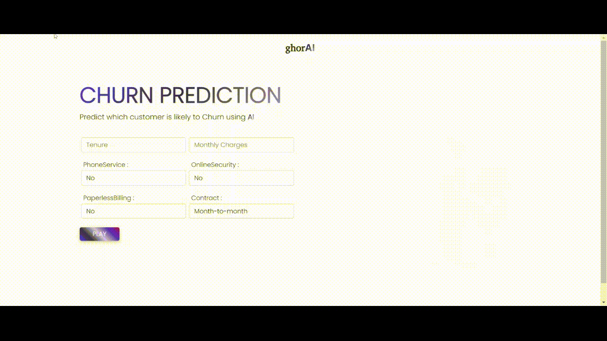

<h1 align='center'> Customer Churn Prediction </h1>
<h2 align='center'> Predict if a customer will churn or not using Machine learning </h2>


In this repository, we have performed the end to end Exploratory Data Analysis, and idenfitied the characteristics of the customers that are more likely to churn, and I have used them wisely to create a model, and lately, have deployed the model using `flask` and `heroku`.

<p align='center'> 
    
</p>

----------------------------

## Approach : 

* Performed some data cleaning and feature engineering on raw data. 
* Selected 6 best features to deploy. 
* fitted multiple classification model and finally selected the stacked classification model.
* Saved the model in a `.pkl` file and.
* Later used the same model in the `flask app` and for frontend used `HTML, CSS` and `Bootstrap`.
* Deployed the whole project on ``Heroku` and used `Google Analytics` for tracking users.
------------------------------

## How to run? 

> To run the app you need to download this repository along with the required libraries. and you have to the `app.py` file. 

> after running `app.py` open [http://127.0.0.1:5000](http://127.0.0.1:5000)

------------------------------- 

## Document Structure 

```
Personal Finance 
│
|---- Data
|   |-- ML_models
|   |   |--
|   |
|   |-- preprocessed_data.csv
|   |-- WA_Fn-UseC_-Telco-Customer-Churn.csv
|
|---- images
|   |-- Churn-Prediction_Trim.gif
|
|---- notebooks 
|   |-- models
|   |   |-- analyseModel.py
|   |   |-- hyperparameterTuning.py
|   |   |-- *.ipynb
|   |-- *.ipynb
|
|---- static 
|   |-- images
|   |   |-- favicon
|   |   |   |-- *.png
|
|   |-- styles
|   |   |-- layout.css
|   
|---- templates
|   |   |-- index.html
|   |   |-- layout.html
|   |   |-- prediction.html
|
|---- .gitignore
|---- app.py
|---- LICENSE
|---- Procfile
|---- README.md
|---- requirements.txt
|---- runtime.txt

```
---------------------

## Technologies used : 

* python library - numpy, pandas, seaborn, matplotlib, flask, plotly, sklearn, pickle, xgboost
* version control - git 
* backend - flask
* concept - Machine Learning

## Tools and Services : 
* IDE - Vs code 
* Application Deployment - Heroku
* Code Repository - GitHub

-----------------------
<br>

# If you Liked this project the you can consider connecting with me:
* [LinkedIn](https://www.linkedin.com/in/soumyadip-ghorai/) 

* You can find my other projects and EDAs on [Kaggle](https://www.kaggle.com/soumyadipghorai)
